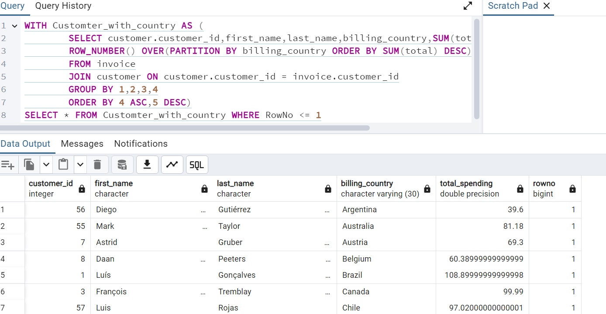
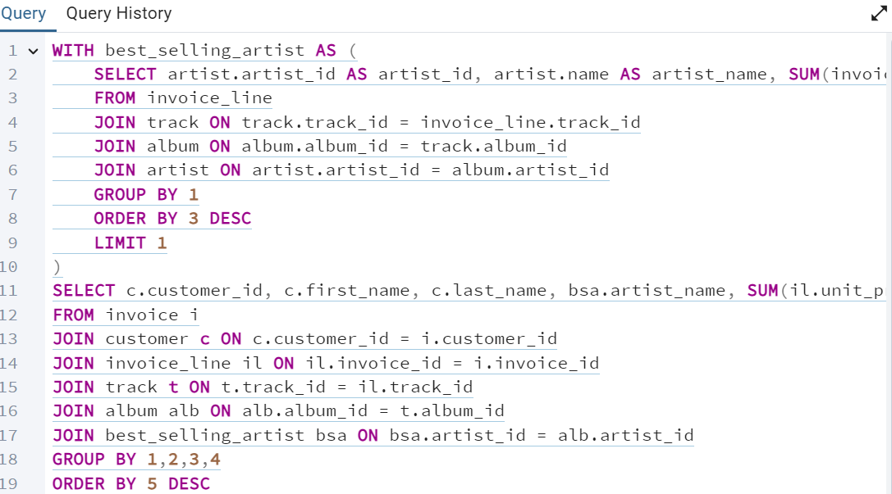

# Music Store Analysis - SQL Project

This repository contains a SQL project focused on analyzing a music store's database using PostgreSQL with pgAdmin 4. The project demonstrates the application of SQL to solve a range of queries from easy to advanced levels.

## Project Overview

In this project, you'll find various SQL scripts and queries used to explore and analyze the music store's data. The analysis includes solving different types of questions, such as:

- Basic data retrieval
- Aggregation and grouping
- Joins and subqueries
- Advanced functions and window functions
- Data manipulation and management

## Key Features

- **Diverse Query Examples**: A comprehensive collection of SQL queries, ranging from basic to advanced, each designed to address specific problems or tasks.
- **Detailed Documentation**: Each query is well-documented to explain its purpose and the logic behind it.
- **Practical Applications**: Real-world scenarios and business questions that provide practical insights into data analysis using SQL.

## Screenshots

### Joins and Subqueries


### Advanced Functions


## Getting Started

To get started with this project, you'll need to have PostgreSQL and pgAdmin 4 installed. Clone the repository and use the provided SQL scripts to create and populate the database.

### Requirements

- PostgreSQL
- pgAdmin 4
- Database (https://github.com/Yash-Patil09/Music-Store-Analysis/blob/main/Music%20Store%20Analysis/Music_Store_database.sql)

### Usage

1. Clone the repository:
   ```bash
   git clone [https://github.com/Yash-Patil09/Music-Store-Analysis.git]

